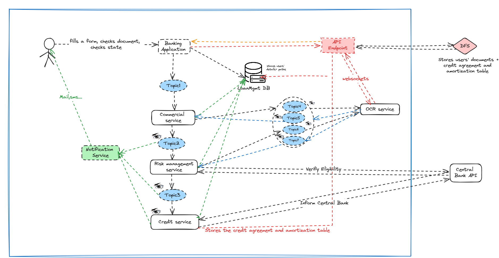

# Towards More Reactive Microservices

Welcome to our Software Architecture Lab repository. This project showcases a mock implementation of several services within our solution, emphasizing basic communication patterns between them.

## Overview

In this repository, you'll find an illustration of microservices architecture, highlighting reactivity and inter-service communication. Each service is tailored to fulfill a specific function within the system, with communication facilitated by RabbitMQ messaging queues.

## Requirements

- **RabbitMQ**: This project relies on RabbitMQ for message queuing. Ensure RabbitMQ is installed and running locally or on a remote server.
- **Python 3.12**: This project utilizes upgraded f-string syntax available in Python 3.12. Make sure you have Python 3.12 installed on your system to run the services successfully.

## Setup

Before running the services, follow these steps:

1. Ensure RabbitMQ is running.
2. Run `banking_app.py` once to create the necessary queues for communication between services.
3. Run the other services.
